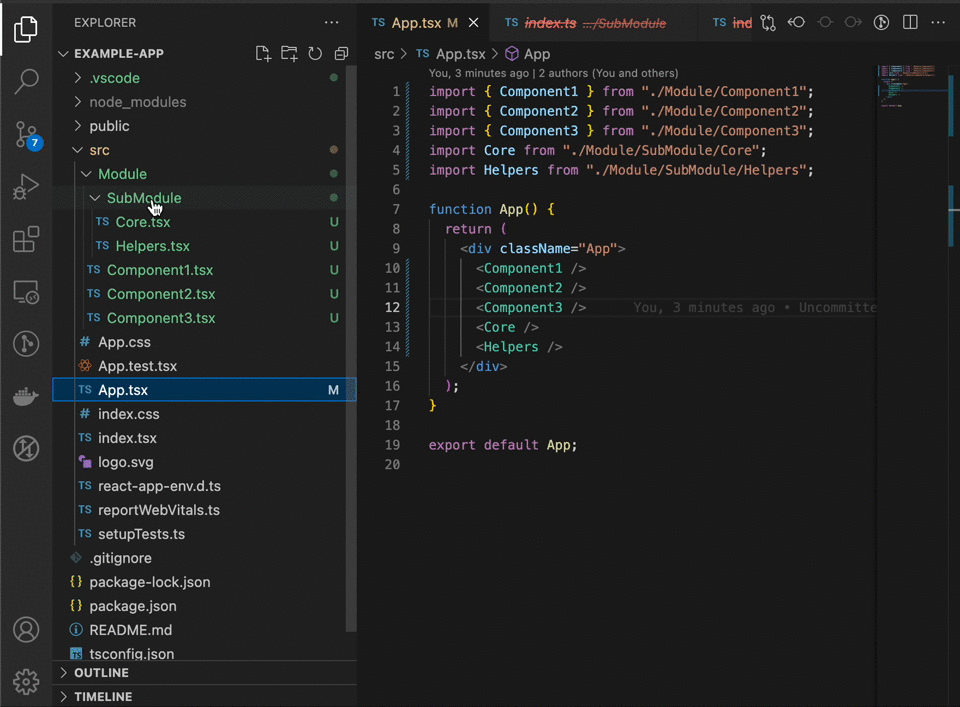

## What this project does

This Project has 3 main features

- Allows you to insert, update, and delete index files. This will automatically adjust imports, export proxies, and handle naming conflicts.
- Allows you quickly see a folder's "public interface" by seeing references into and out of the folder. This is an alternative to maintaining actual index files.
- Allows you to see a readout of the unused exports inside a folder

## Adding Index Files

## Deleting Index Files

